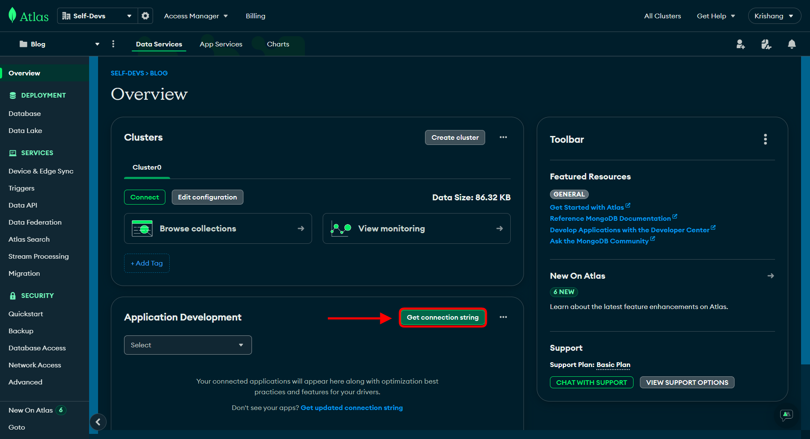
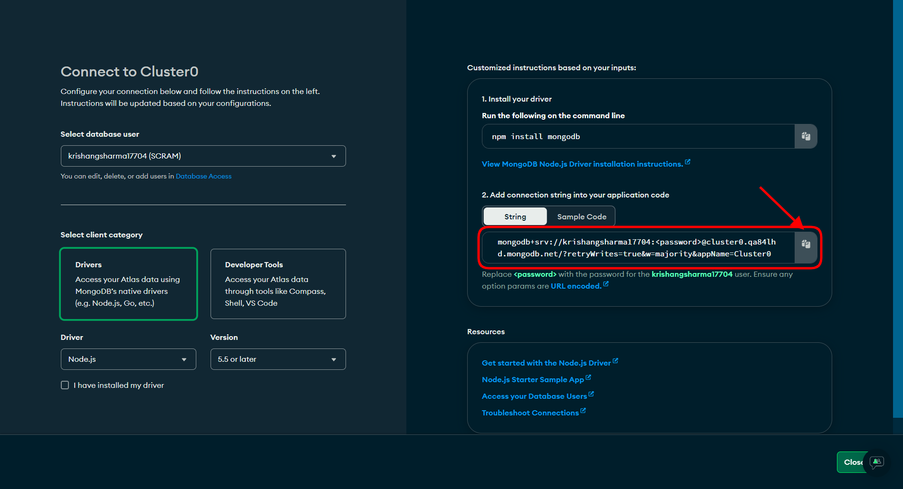
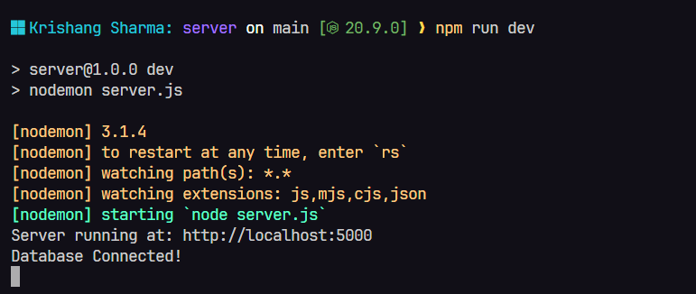

# Internship Evaluation Assignment

## MERN Stack Todo App

To test the app on your local machine, follow the given steps:

### 1. Clone the repository

Go to the home page of the [repository](https://github.com/KrishangSharma/assignment-react-todo.git) and download the `zip` files for the code.

Or alternatively, open a terminal in your preferred directory and execute the following command:

`git clone https://github.com/KrishangSharma/assignment-react-todo.git`

### 2. Install the packages

From the root directory, run `cd ./server` and then run `npm install` to install all the required dependencies.

### 3. Initialize Environment Variables

To get the app up and running, you need to set an environment variable first, which is: **MONGO_URI**, for storing data to DB.

1. To set this up, head over to [mongoDB](https://mongodb.com), sign up or login and then create a cluster.
2. From the Cluster homepage, scroll down to `Application Development` and click on `Get Connection String`.
   

3. On the opened page, on thr right side, copy the connection string and paste it in the .env file.
   

_Important_: Make sure to restart the server if you change any env variable(s).

### 4. Start the App

1. Head into the `server` directory and run `npm run dev`. If everything was setup correctly, you'll see something like this:

2. To start the client dev server, head into the client directory by running `cd client` from the root directory. 
3. Then run `npm install` to download all the required packages. 
4. And then run `npm run dev` to start the vite dev server. 

## Available Routes

1. Requests can be made using an API client like Postman or Insomnia.
2. All requests need to be in JSON format
3. URL: `http://localhost${your_port}/todo`

| Routes           | Method | Params             |
| ---------------- | ------ | ------------------ |
| 1. /new          | POST   | title              |
| 2. /:id          | PATCH  | todoId(in the URL) |
| 3. /:id          | DELETE | todoId(in the URL) |
| 4. /all          | GET    | -                  |
| 5. /search/query | GET    | query(in the URL)  |
